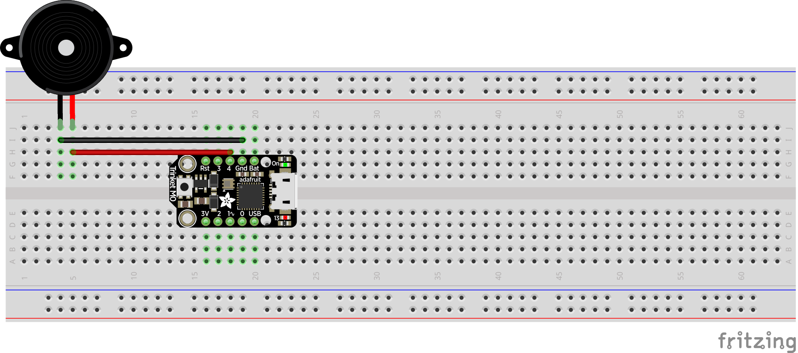

# Piezo Buzzer Test

This test is designed to test the usage of a Piezo Buzzer on an Arduino Trinket M0. The code will be using Circuit Python.

## Usage

Assemble the circuit as shown in WiringDiagram.png. Install Circuit Python on the Trinket M0, if it is not currently installed. Then copy src/main.py into the Trinket M0 root directory. If you want to turn on and off the buzzer, simply set the buzzer.duty_cycle to ON or OFF respectively.

## Wiring Diagram

## References

[Adafruit Guide](https://learn.adafruit.com/using-piezo-buzzers-with-circuitpython-arduino)