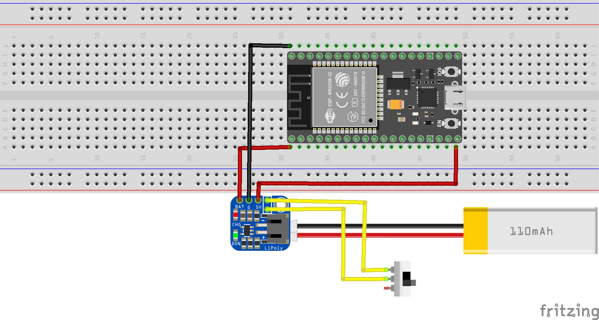

# LiPoly Backpack

This test is designed to test the usage of a Lithium Polymer battery on the Trinket M0.

Note: Pay close attention to the pinout diagram.

## Usage

Assemble the circuit as shown in the WiringDiagram.png. Disconnect the trinket M0 from USB and observe it is still activated.

## WiringDiagram

## References

[Pinout Description](https://learn.adafruit.com/adafruit-pro-trinket-lipoly-slash-liion-backpack/pinouts)