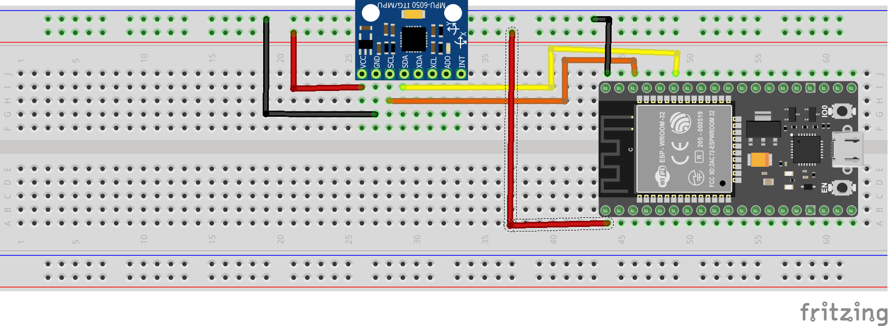

# MPU-6050 Accelerometer + Gyroscope

This test is designed to test the usage of the MPU 6050 with an Arduino Uno. Even though the trinket m0 is the main microprocessor we target, we will be using the Uno for this test.

## Usage

Assemble the circuit as shown in WiringDiagram.png. If you are using the Arduino ide, you can view the output of the MPU-6050 in the Serial Monitor.

## Wiring Diagram

## References

[Adafruit Guide](https://learn.adafruit.com/mpu6050-6-dof-accelerometer-and-gyro)
